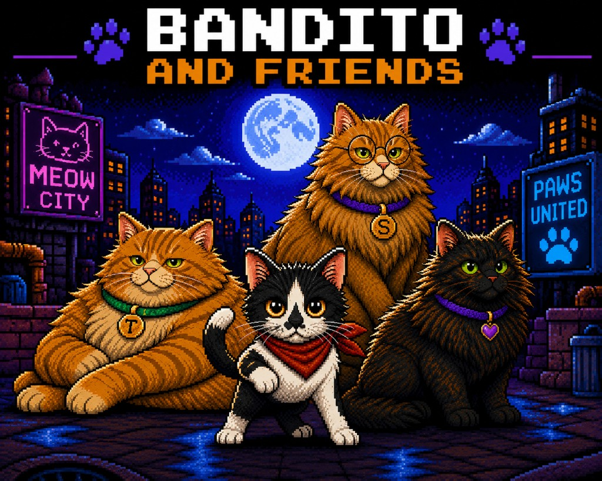
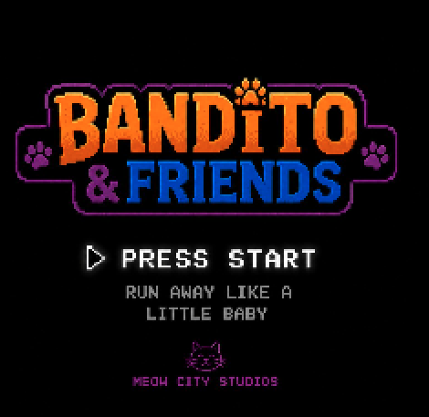
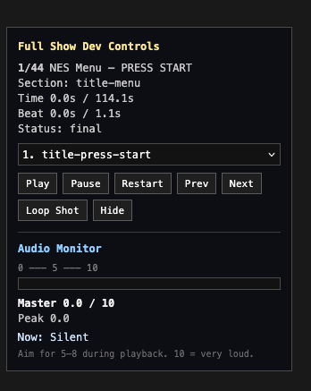

<p align="center">
  
</p>

<h1 align="center">Bandito and Friends</h1>

<p align="center">
  <strong>See the YouTube video? This is the final product.</strong>
</p>

<p align="center">
  <a href="https://youtube.com/shorts/hWR0eq0EQOw?feature=share" style="font-size: 1.5em; font-weight: bold;">▶ Watch Episode 1: The Sock Monster</a>
</p>

<p align="center">
  <strong>A code-driven 8-bit animated short series — built, scored, and exported entirely in JavaScript.</strong>
</p>

<p align="center">
  <em>Inspired by classic NES intros and cutscenes. Produced for vertical video — YouTube Shorts and TikTok.</em>
</p>

<p align="center">
  <a href="story/episode-01-the-sock-monster.md">Episode 1 script</a> ·
  <a href="story/order-of-operations.md">Production runbook</a> ·
  <a href="story/NEW-EPISODE.md">New episode checklist</a> ·
  <a href="art/style-guide.md">Art style guide</a>
</p>

---

## What is this?

**Bandito and Friends** is not a traditional video edit. It is a **timeline-driven animation engine** — a miniature NES-era production studio written in code.

Every frame of Episode 1 is orchestrated from data: shot timing, camera moves, subtitles, sound effects, and music cues. The browser renders a crisp **270 × 480** pixel stage (9:16). A custom export pipeline captures that stage frame-by-frame and upscales it to **1080 × 1920** for delivery.

The result is a complete ~**114-second** show:

**NES title menu → pixel-load transition → series opening → Meet the Team → Episode 1: The Sock Monster → credits**

No game engine. No After Effects timeline. No video editor as the source of truth. **The repo is the studio.**

---

## Built in code

<table>
<tr>
<td width="50%" valign="top">

### 🎬 Animation & story

- **PixiJS** renderer with nearest-neighbor scaling — pixel art stays sharp
- **Data-driven episode player** — 33 shots defined in `episode-01-shots.js`
- Camera system: pan, push-in, focal zoom, letterbox/cover fit, shake
- NES title menu, Mega Man–style pixel load, series opening crawl
- Shorts-safe subtitle layout with timed dialogue sections

</td>
<td width="50%" valign="top">

### 🎵 Music & sound

- **Original procedural scores** — square waves, triangle bass, drums, all composed in JavaScript
- Intro theme, series opening, patrol music, battle themes, victory stinger, credits callback
- **SFX library** — menu blips, title reveal, flash, battle stings, episode card cue
- Offline WAV generation for export; live Web Audio playback in the browser
- Built-in **audio meter** for mix-level monitoring during dev

</td>
</tr>
<tr>
<td width="50%" valign="top">

### 🖼️ Visual art

- Episode artwork created with **ChatGPT** (DALL·E), curated and finalized for vertical framing
- Character sprite sheets, Meow City environments, battle shots, and end cards
- Canon art docs, style guide, and production references in `art/`

</td>
<td width="50%" valign="top">

### 📤 Video export

- Custom **full-show exporter** — Playwright frame capture + FFmpeg encode
- Deterministic `seekToMasterTime()` rendering — same frame every time
- Full-show audio timeline mix (title menu → episode → credits)
- Parallel chunk rendering, H.264/AAC output, automated validation
- Dev UI **and** CLI — one button or `npm run export:episode1`

</td>
</tr>
</table>

---

## See it in action

<p align="center">
  
  &nbsp;&nbsp;
  
</p>

<p align="center">
  <sub><strong>Left:</strong> NES title menu in the browser &nbsp;·&nbsp; <strong>Right:</strong> Full Show Dev Controls — scrub any of 44 beats, monitor audio levels, export MP4</sub>
</p>

The **Full Show Dev Controls** panel is the project's control room: play, pause, scrub, loop individual shots, jump to any beat in the ~114s timeline, and watch a live master audio meter while you mix.

---

## Episode 1 at a glance

| | |
|---|---|
| **Title** | The Sock Monster |
| **Runtime** | ~114 seconds (full show) |
| **Shots** | 33 story beats + title menu, opening, intros, credits |
| **Format** | 9:16 vertical (270×480 internal → 1080×1920 export) |
| **Stack** | Vite · PixiJS · Plain JavaScript · FFmpeg · Playwright |

**Story beats:** Bandito patrols Meow City → discovers a sock → Sir Sockington attacks → the team assembles → Tortellini saves the day → reality shifts to the human living room → heroic celebration → credits.

👉 **[Clickable shot-by-shot runbook](story/order-of-operations.md)** — preview every beat in the browser.

---

## Quick start

### Requirements

- [Node.js](https://nodejs.org/) v18+
- [FFmpeg](https://ffmpeg.org/) (for video export)

```bash
brew install ffmpeg   # macOS
npm run export:check  # verify FFmpeg is available
```

### Run locally

```bash
npm install
npm run dev
```

Open **http://localhost:5173/** to watch the full show.

**Preview modes:**

| URL | What plays |
|-----|------------|
| `/` | Full show (title menu → Episode 1 → credits) |
| `/?scene=title-menu` | NES title screen only |
| `/?scene=opening` | Series opening |
| `/?scene=episode` | Episode 1 with dev controls |
| `/?scene=episode&shot=16` | Jump to a specific shot (0-based index) |

---

## Export a finished MP4

The exporter renders the **complete show timeline** — not just the episode — including title menu SFX, series opening music, intro theme, and all episode music/SFX.

### From the browser

1. `npm run dev`
2. Open `http://localhost:5173/?scene=episode`
3. Click **Export Episode 1 MP4**
4. Download when complete

### From the terminal

```bash
npm run export:episode1          # full ~114s export
npm run export:episode1:test     # 5-second smoke test
npm run export:episode1:profile  # profile a representative section
```

Output lands in `exports/episode-1/`. Procedural audio is cached under `exports/episode-1/audio/cache/` — clear that folder after changing procedural cue volumes.

---

## How the music is made

Music is not imported from a DAW. Each cue is a **JavaScript score module** — note arrays with beat timing, pitch, and channel envelopes — rendered through a Web Audio synthesizer at runtime and baked to WAV for export.

| Cue | Used for |
|-----|----------|
| `intro-theme` | Meet the Team character intros |
| `series-opening-music` | Meow City establishing sequence |
| `adventure-calm` | Bandito patrol (shots 05a–05c) |
| `sock-monster-battle` | Battle sequence |
| `living-room-reveal-1` | Human living room reveal |
| `heroes-victory-1` | Rooftop celebration |
| `team-theme-credits` | Credits, tools, and thanks slides |

Regenerate WAV assets:

```bash
npm run generate:music
npm run generate:sfx
```

---

## Project structure

```
src/
  app.js                          PixiJS boot, full-show routing, responsive scaling
  data/
    activeEpisode.js              Which episode plays by default — change for Episode 2+
    episodes/                     Episode registry and per-episode config
    episode-XX-shots.js           Shot lists (one file per episode)
    episode-template-shots.js     Starter template for new episodes
  episode/                        Data-driven episode renderer and shot helpers
  dev/                            Full-show timeline, dev controls, audio meter
  audio/                          Music library, scores, SFX, playback
  scenes/                         Title menu, intro, series opening, crawl
  export/                         Export client and full-show audio timeline
  transitions/                    NES pixel-load transition
export/                           Playwright render pages (see export/README.md)
exports/                          Generated MP4 output (gitignored)
server/export/                    Playwright capture, FFmpeg encode, audio mix
public/images/                    Episode and series-opening final art
story/                            Scripts, NEW-EPISODE.md checklist, templates
art/                              Style guide, character canon, Meow City lore
```

Internal stage: **270 × 480** pixels. Scales up with nearest-neighbor filtering — no blur on pixel art.

---

## Build

```bash
npm run build    # production bundle
npm run preview  # preview the production build
```

---

## Credits

**Created by Audrey and Chris McClure.**

Artwork generated with ChatGPT · Music and SFX composed in code · Animation engine, export pipeline, and dev tools built from scratch.

<p align="center">
  <sub>Meow City Studios 🐾</sub>
</p>
